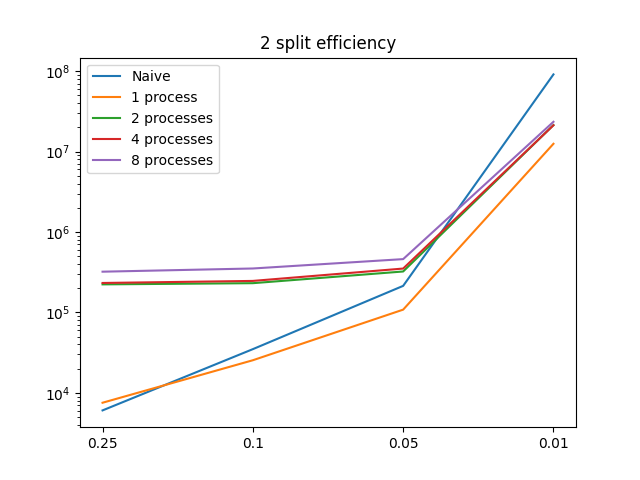
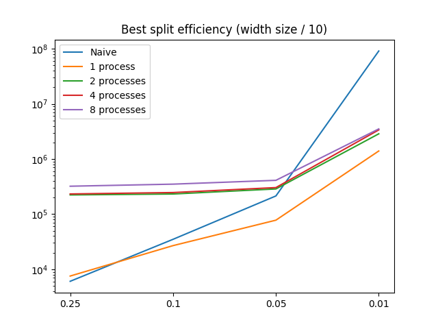

## Вычислительный эксперимент

Решение краевой задачи Пуассона в прямоугольной области с граничными условиями Дирихле

#### Алгоритмы для сравнения

* Прямой (нахождение матрицы K и решение системы уравнений в явном виде)
* Параллельный в n процессов (разбиение матрицы K на куски с последующей параллельной обработкой)
* Один поток с разбиением матрицы K

#### Конфигурация машины

```
Model Name:	            MacBook Pro
Model Identifier:	    MacBookPro17,1
Chip:	                    Apple M1
Total Number of Cores:	    8 (4 performance and 4 efficiency)
Memory:	                    8 GB
```

#### Сравнение с теоретическими результатами

Оценка качества производилось путем проверки идентичности результатов параллельного алгоритма значениям полученным с помощью наивного алгоритма. 

#### Промежуточные выводы

Основное узкое место даннной реализации - передача больших объектов между процессами. Возможные исправления:

* Переписать код на другой язык с параллелизмом через потоки
* Хранить матрицы в разреженном виде (done - получено значительное ускорение)
* Воспользоваться другим интерпретатором Python без GIL.

Помимо этого еще одно значительное узкое место этой реализации в том, что параллелизм возможен только по оси X. В ином случае представленный алгоритм из книги "A Tutorial on Elliptic PDE Solvers and their Parallelization" нуждался бы в модификации.

#### Таблица с результатами сравнения 

Значения времени приведены в микросекндах. Все значения из таблицы получены как средние на 5 запусках алгоритма.

| Размер грида | Количество частей (влияет только на параллельные) | Прямой | Параллельный (2 процесса) | Параллельный (4 процесса) | Параллельный (8 процессов) | Один поток |
|--------------|---------------------------------------------------|--------|---------------------------|---------------------------|----------------------------|------------|
| 3x7          | 2 | 6051 | 223312 | 232483 | 321190 | 7536 |
| 3x7 | 4 | 6051 | 212338 | 229076 | 330518 | 9767 |
| 9x19 | 2 | 34954 | 231098 | 246578 | 352008 | 25442 |
| 9x19 | 5 | 34954 | 232049 | 246658 | 350291 | 26859 |
| 19x39 | 2 | 213956 | 322974 | 351332 | 460263 | 108337 |
| 19x39 | 4 | 213956 | 286609 | 303340 | 410802 | 77766 |
| 19x39 | 5 | 213956 | 283618 | 300108 | 412930 | 76318 |
| 19x39 | 10 | 213956 | 292591 | 310837 | 428226 | 87345 |
| 99x199 | 2 | 91209456 | 21374968 | 21264259 | 23474885 | 12512354 |
| 99x199 | 5 | 91209456 | 8508884 | 8585133 | 7753020 | 2365001 |
| 99x199 | 10 | 91209456 | 2867162 | 3377816 | 3520860 | 1399444 |
| 99x199 | 50 | 91209456 | 9135481 | 9491787 | 9540573 | 8554592 |
| 99x199 | 100 | 91209456 | 36739771 | 36825981 | 36051961 | 35383326 |


#### Выводы

* На достаточно больших гридах наивное решение побеждается любым алгоритмом
* Параллелизация на потоках все еще жизненно необходима для качественной работы алгоритма
* Слишком большой сплит это тоже плохо, так как он увеличивает размер матрицы K_C
* PyPy не устанавливается на M1(

#### Графики




[//]: # (| 3x7         | 2 | 7081 | 214517 | 261871 | 332342 | 7619 |)

[//]: # (| 3x7         | 4 | 7081 | 212108 | 227595 | 327500 | 9853 |)

[//]: # (| 11x23       | 2 | 55120 | 243808 | 258057 | 351036 | 36189 |)

[//]: # (| 11x23       | 4 | 55120 | 238130 | 252380 | 359913 | 32372 |)

[//]: # (| 11x23       | 6 | 55120 | 241772 | 255428 | 356424 | 35957 |)

[//]: # (| 11x23       | 8 | 55120 | 271974 | 295631 | 558411 | 42673 |)

[//]: # (| 23x47       | 2 | 370304 | 432510 | 442415 | 592309 | 172816 |)

[//]: # (| 23x47       | 4 | 370304 | 348521 | 368964 | 537225 | 114527 |)

[//]: # (| 23x47       | 6 | 370304 | 317451 | 333756 | 474409 | 105078 |)

[//]: # (| 23x47       | 8 | 370304 | 317928 | 333404 | 454976 | 108788 |)

[//]: # (| 47x95       | 2 | 2954694 | 1435912 | 1424940 | 1611912 | 1312584 |)

[//]: # (| 47x95       | 4 | 2954694 | 1057048 | 1081890 | 1199994 | 589153 |)

[//]: # (| 47x95       | 8 | 2954694 | 733459 | 754707 | 878662 | 412010 |)

[//]: # (| 47x95       | 16 | 2954694 | 729740 | 780958 | 904525 | 491255 |)

[//]: # (| 47x95       | 32 | 2954694 | 1223792 | 1257877 | 1417492 | 972306 |)

[//]: # (| 30x255      | 2 | 6405121 | 4473117 | 4136816 | 3765920 | 2041063 |)

[//]: # (| 30x255 | 16 | 6405121 | 864934 | 978057 | 1119710 | 587606 |)

[//]: # (| 30x255 | 64 | 6405121 | 1602532 | 1718704 | 1724429 | 1475207 |)

[//]: # (| 20x511 | 128 | 12046285 | 1496570 | 1360036 | 1590074 | 1787844 |)

[//]: # (| 20x1023 | 128 | 85148709 | 1953448 | 1785380 | 2001302 | 1431663 |)

[//]: # (| 100x1023 | 64 | --- | 18041711 | 18354258 | 19490656 | 17087564 |)

[//]: # (| 100x1023 | 128 | --- | 65417543 | 66035222 | 64312258 | 64179343 |)